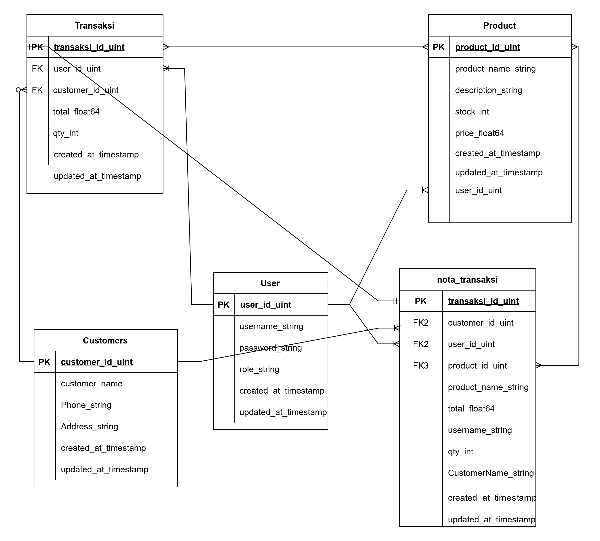

# group_project_1
Group project for Alterra Academy BE 19

Selamat datang di Tokoku App!

Ini adalah aplikasi toko online sederhana untuk mencatat transaksi, nota, barang, dan pelanggan.

Penggunaan:

1. Buatlah terlebih dahulu sebuah database di SQL dengan nama project1
2. Pastikan database local terhubung sebelum menjalankan main.go
3. jalankan main.go
4. secara otomatis program akan membuat user "admin", dengan password "admin"
5. pilih menu login
6. login dengan username dan password yang ada. Bila user selain admin masih kosong, login lah dengan username admin
7. silakan memilih menu sesuai kebutuhan. 1 untuk menambah pegawai(user), 2 untuk melihat daftar pegawai, dst. Untuk saat ini buatlah satu pegawai
8. Tambahkan Produk untuk dijual
9. Tambahkan Customer sesuai alur program
10. Jika Anda login menggunakan akun pegawai, akan terlihat tampilan berbeda dan fitur yang terbatas, ini dikarenakan pegawai tidak memiliki kewenangan admin

